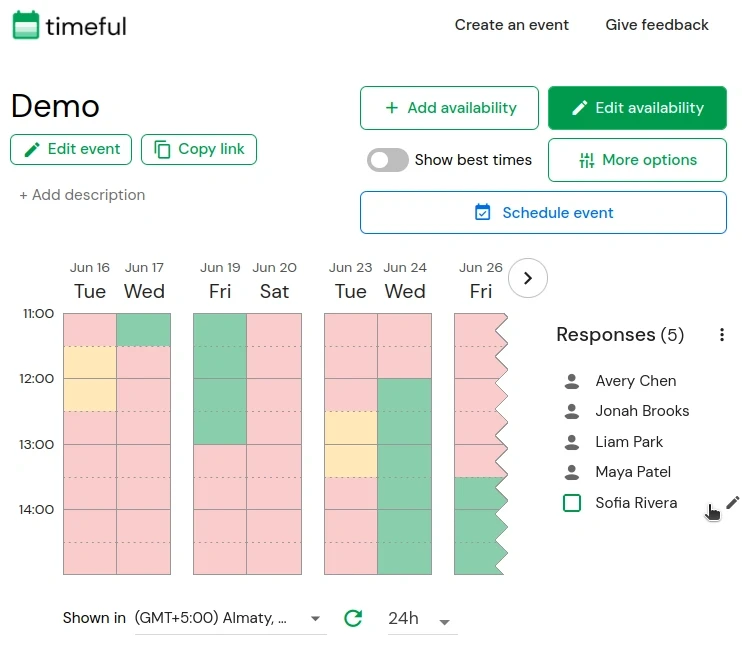

  

 

Timeful is a scheduling platform helps you find the best time for a group to meet. It is a free availability poll that is easy to use and integrates with your calendar.

Original implementation: <https://github.com/schej-it/timeful.app>

Hosted version of the site: <https://timeful.app>

Built with [Vue 3](https://github.com/vuejs/core), [MongoDB](https://github.com/mongodb/mongo), [Go](https://github.com/golang/go), and [TailwindCSS](https://github.com/tailwindlabs/tailwindcss)

## Demo

## Features

- See when everybody's availability overlaps
- Easily specify date + time ranges to meet between
- Google calendar, Outlook, Apple calendar integration
- "Available" vs. "If needed" times
- Determine when a subset of people are available
- Schedule across different time zones
- Email notifications + reminders
- Duplicating polls
- Availability groups - stay up to date with people's real-time calendar availability
- Export availability as CSV
- Only show responses to event creator

## Plugin API

Read these docs to design your own browser plugins to get + set availability on Timeful events programmatically!

[Plugin API Docs](./PLUGIN_API_README.md)

## Self-hosting

See the [Deployment Guide](./DEPLOYMENT.md) for Docker Compose and NixOS setup instructions.

See [docs/environments.md](./docs/environments.md) for the root env-file model used for development, staging, and production environments.
